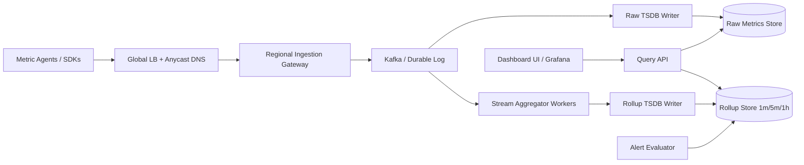
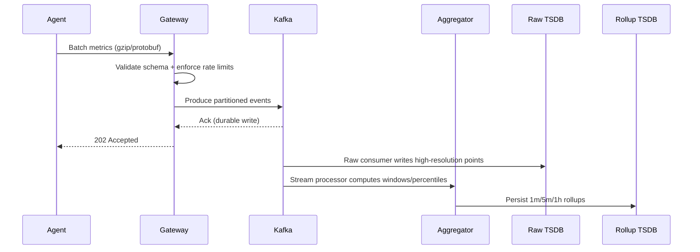
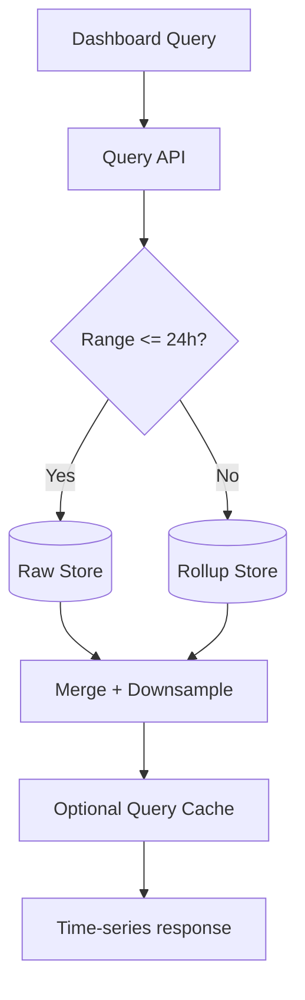

# Question 1: Design a Distributed Metrics Logging and Aggregation System

This example is structured using the repository's interview framework, vocabulary, and design patterns.

---

## 1) Clarify Requirements (First Principles)

### Functional Requirements
- Ingest metrics from services/hosts across many regions.
- Support high-cardinality tags (service, host, region, env, endpoint).
- Query aggregated metrics for dashboards and alerts.
- Support time-window aggregations (avg, p50/p95/p99, sum, max).
- Retain raw and rolled-up data with different TTLs.

### Non-Functional Requirements
- **Write-heavy** system (metrics ingestion dominates reads).
- **High availability** for ingestion path (target 99.99%).
- **Low-latency reads** for dashboard queries (p95 < 2s).
- **Durability** for accepted writes (avoid metric loss under node failures).
- **Eventual consistency** for dashboard views is acceptable (seconds).

### Scope Boundaries
- In scope: counters/gauges/histograms, dashboard and alerting query path.
- Out of scope: trace/span storage, log search UI, long-term BI warehouse.

---

## 2) Back-of-the-Envelope Estimation

Assumptions:
- 200,000 hosts
- 150 metric points/sec per host at peak
- Replication factor = 3
- Average compressed point = 40 bytes

Calculations:
- Peak ingest = `200,000 * 150 = 30,000,000 points/sec`
- Raw write bandwidth = `30,000,000 * 40 B = 1.2 GB/sec`
- With replication (x3) = `3.6 GB/sec`
- Daily raw storage = `1.2 GB/sec * 86,400 ≈ 103.7 TB/day` (before replication)

Design implication:
- We need **partitioned ingestion**, **batched writes**, and **tiered retention**.
- Storing all raw data at high resolution for long periods is expensive; use rollups.

---

## 3) High-Level Architecture



### Why this decomposition (first principles)
- **Separate write path and read path** to isolate ingestion bursts from query traffic.
- Use a **message broker** to absorb spikes and enable replay.
- Maintain **raw store + rollup store** to balance query speed and storage cost.
- Keep API stateless to allow horizontal scaling behind load balancers.

Patterns used:
- **Message Queues & Async Processing**: decouple producers from consumers.
- **Database Scaling**: partition by metric key + time bucket.
- **Caching** (optional at query layer): cache hot dashboard panels.
- **Load Balancing**: regional L7 ingress + stateless query API autoscaling.

---

## 4) Data Model and APIs

### Canonical metric point
```json
{
  "metric_name": "http.request.duration_ms",
  "timestamp": 1776028800,
  "value": 123.4,
  "type": "histogram",
  "tags": {
    "service": "checkout",
    "region": "us-east-1",
    "env": "prod",
    "endpoint": "/pay"
  }
}
```

### Ingestion API
- `POST /v1/metrics:write`
  - Accepts batched points.
  - Returns ack with accepted/rejected counts.

### Query API
- `GET /v1/metrics:query?metric=http.request.duration_ms&agg=p95&from=...&to=...&step=60&filters=service:checkout,env:prod`
- `GET /v1/metrics:series?prefix=http.request&limit=100`

---

## 5) Write Path (Detailed)



Key decisions:
- **Partition key**: hash(metric_name + stable tag subset) for balanced partitions.
- **Backpressure**: gateway throttles by tenant/service on queue depth.
- **Idempotency**: dedupe key `(metric_id, timestamp, tagset_hash)` for retries.

---

## 6) Read Path (Detailed)



Strategy:
- Recent windows: prefer raw for precision.
- Historical windows: prefer rollups for speed and cost.
- Merge partial results across shards; return aligned time buckets.

---

## 7) Storage and Retention Strategy

- **Raw metrics**: 7 days TTL, high-resolution.
- **1-minute rollups**: 30 days TTL.
- **5-minute rollups**: 180 days TTL.
- **1-hour rollups**: 1+ year TTL.

Compaction/encoding:
- Columnar/time-series compression.
- Segment files organized by `(tenant, metric, day, shard)`.

---

## 8) Reliability, Availability, and Consistency

- Multi-AZ Kafka and storage clusters.
- Replication factor 3 for log and TSDB.
- Exactly-once is expensive; use **at-least-once + idempotent writes**.
- On regional outage: agents fail over to secondary regional endpoint.
- During downstream outage: continue buffering in durable log; recover via replay.

---

## 9) Observability and Operations

Track system SLIs:
- Ingestion success rate, end-to-end lag, queue depth.
- Query p50/p95/p99 latency by time range.
- Consumer lag by partition and tenant.
- Write/read error rates.
- Cost per ingested million points.

Alerts:
- Queue depth growth without recovery.
- Hot partition detection.
- Rollup delay over threshold.

---

## 10) Trade-offs and Evolution

Trade-offs:
- Raw-only design = simpler but expensive and slower for long-range queries.
- Heavy pre-aggregation = faster reads but less ad-hoc flexibility.
- Strong consistency on queries = slower and more complex; eventual is acceptable here.

Possible v2 improvements:
- Adaptive sampling for extremely high-cardinality dimensions.
- Tiered object storage for cold rollups.
- Materialized views for top-N and SLO dashboards.
