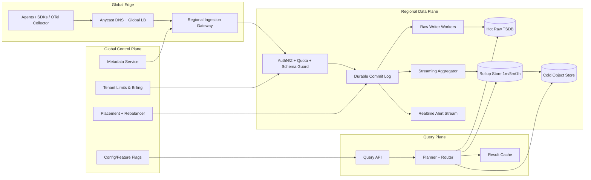
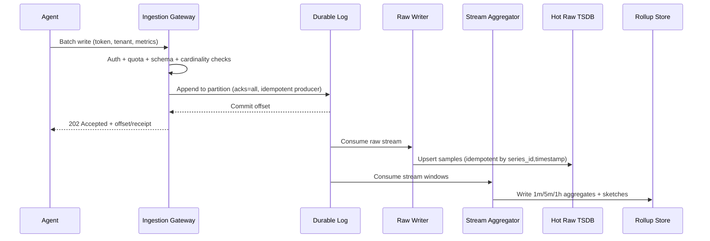
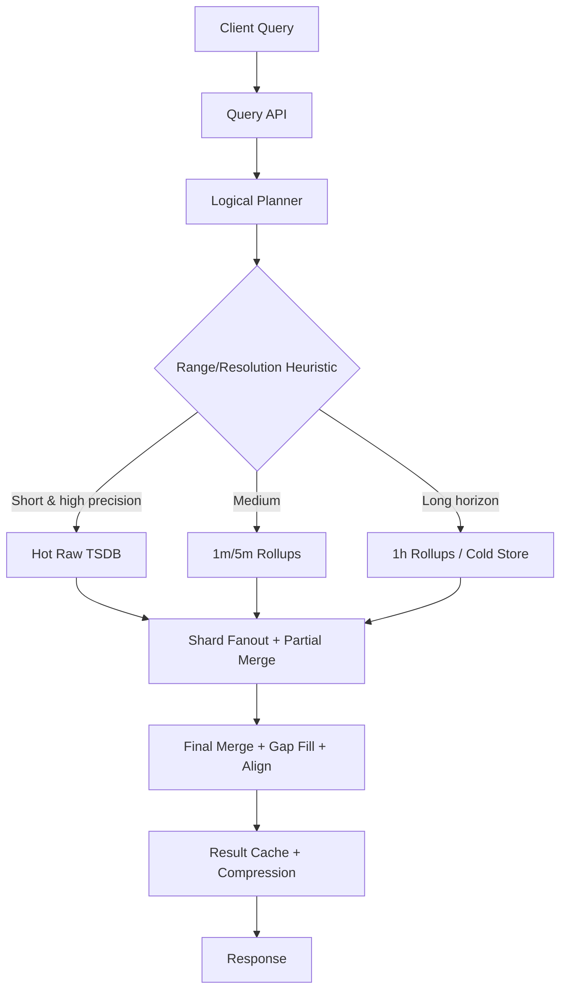

# Question 1: Design a Distributed Metrics Logging and Aggregation System (IC6/IC7 Depth)

This version targets **Principal Engineer (IC6/IC7)** expectations: clear SLOs, explicit failure modes, multi-tenant isolation, cost controls, and an architecture that can evolve safely at very large scale.

---

## 1) Clarify Requirements and Product Contract

### Functional Requirements
- Ingest metrics from services/hosts across many regions and environments.
- Support counters, gauges, histograms/distributions, and exemplars.
- Support high-cardinality dimensions (service, cluster, host, endpoint, customer, build SHA).
- Query aggregated metrics for dashboards, ad-hoc analysis, and alert evaluation.
- Support windowed computations: `sum`, `avg`, `rate`, `min/max`, `p50/p95/p99`, `count_distinct` (bounded/approx).
- Retain raw and rolled-up data across different horizons and costs.
- Support tenant-level RBAC and billing/accounting.

### Non-Functional Requirements (SLO-Oriented)
- **Ingestion availability:** 99.99% monthly for accepted writes.
- **Write durability:** once ACKed, probability of permanent loss < 1e-9 per point.
- **Freshness SLO:** p99 ingest-to-query visibility < 10s for near-real-time dashboards.
- **Read latency SLO:** p95 < 2s for common dashboard queries; p99 < 5s.
- **Scalability:** absorb 2x regional burst traffic for 30 minutes without dropping premium-tier tenants.
- **Security/compliance:** encryption in transit + at rest, tenant isolation, configurable regional data residency.

### Scope Boundaries
- In scope: metrics ingest/query pipeline + rollups + alert evaluation dependencies.
- Out of scope: full-text log search, tracing storage, BI warehouse ETL.

### Explicit Assumptions
- Multi-tenant SaaS observability backend with paid tiers (gold/silver/bronze).
- Eventual consistency is acceptable for dashboards; alerts need bounded staleness.
- Most reads are repeated dashboard templates; ad-hoc reads are a minority but must remain safe.

---

## 2) Capacity and Cost Model (Back-of-the-Envelope)

Assumptions:
- 250,000 active hosts at peak.
- 120 points/sec/host average; 200 points/sec/host burst.
- Average compressed sample payload (including tags delta-encoding): 32 bytes.
- Replication factor = 3 in durable ingest log; 2 in long-term object tier.

Calculations:
- Steady ingest: `250,000 * 120 = 30,000,000 points/sec`.
- Burst ingest: `250,000 * 200 = 50,000,000 points/sec`.
- Steady raw ingress bandwidth: `30M * 32B = 960 MB/s` (~0.94 GiB/s).
- Daily raw volume (pre-replication): `960 MB/s * 86,400 ≈ 82.9 TB/day`.
- Durable-log written volume (RF=3): ~248.7 TB/day.

Principal-level implication:
- Design for **50M points/sec burst**, not just average.
- Use **tiered retention + adaptive rollups + downsampling** to keep COGS predictable.
- Capacity planning must include **hot-tenant skew** and **tag-cardinality explosions**, not just global averages.

---

## 3) Architecture: Data Plane + Control Plane



### Why this decomposition
- **Data plane** handles throughput-critical ingest/read paths.
- **Control plane** centralizes policy (quotas, schema, placement) without coupling every query to global consensus.
- **Durable log as source of truth for accepted ingest** enables replay, backfill, and deterministic rollup rebuilds.
- **Three storage tiers** (hot TSDB, rollup, cold object) optimize latency vs. cost.

---

## 4) Data Model and Cardinality Strategy

### Canonical Metric Event
```json
{
  "tenant_id": "t-123",
  "metric": "http.server.duration_ms",
  "type": "histogram",
  "timestamp_ms": 1776028800123,
  "value": 123.4,
  "tags": {
    "service": "checkout",
    "region": "us-east-1",
    "cluster": "prod-a",
    "endpoint": "/pay",
    "status_class": "2xx"
  },
  "exemplar": {
    "trace_id": "abc..."
  }
}
```

### Series Identity
- `series_id = hash(tenant_id, metric, normalized_tags)`.
- Tags are normalized (ordered keys, canonical casing, dictionary-compressed).

### Cardinality Guardrails (Critical at IC6/IC7)
- **Per-tenant active series budget** with soft/hard limits.
- **Dimension allow/block lists** (e.g., reject `user_id`, `request_id`).
- **Top-K offender tracking** per tenant + automated remediation hints.
- **Admission controls**: drop or coarsen new-cardinality dimensions when tenant exceeds budget.

---

## 5) APIs and Contracts

### Ingestion
- `POST /v1/metrics:write`
  - Batched protobuf payload, gzip/zstd supported.
  - Semantics: `202 Accepted` means persisted to durable log quorum.
  - Partial acceptance allowed; response returns per-reason rejection counters.

Example rejection reasons:
- `RATE_LIMITED`, `SCHEMA_VIOLATION`, `CARDINALITY_LIMIT`, `AUTHZ_DENIED`.

### Query
- `GET /v1/metrics:query`
  - Params: metric selector, label filters, aggregation, time range, step, timezone.
- `POST /v1/metrics:queryRange`
  - For complex expressions and larger payload filters.
- `GET /v1/metadata:series`
  - Discover label keys/values with limits and pagination.

### SLO-Aware API Behaviors
- Query API enforces execution budgets (CPU/time/memory).
- Large-range queries auto-rewritten to coarser rollups unless `high_precision=true` and authorized.
- Idempotency token optional for client retries in ingest path.

---

## 6) Write Path Deep Dive (Failure-First)



### Key design decisions
- **ACK boundary is durable-log commit, not TSDB write.**
- **At-least-once delivery + idempotent sinks** beats global exactly-once complexity.
- **Partitioning:** `tenant_id + metric_family` primary key, with adaptive sub-partitioning for hot tenants.
- **Backpressure:** hierarchical (global → regional → tenant → API key).

### Failure modes and mitigations
- Log broker loss: quorum replication + rack/AZ awareness.
- Hot partition: dynamic partition split and producer key remap via control plane.
- Consumer lag spike: autoscale consumers; temporarily degrade low-tier tenants.
- Poison pill payloads: dead-letter stream + schema quarantine.

---

## 7) Read Path, Query Planning, and Isolation



### Query planner rules
- Cost-based heuristics: estimate cardinality × time buckets × function complexity.
- Enforce max fanout per query to protect noisy-neighbor impact.
- Opportunistic cache for identical dashboard queries (short TTL, tenant-scoped key).

### Isolation and fairness
- Token-bucket + concurrency pools per tenant tier.
- Priority lanes: alerting queries > dashboard queries > ad-hoc exploratory.
- Query kill-switch and progressive partial results for oversized requests.

---

## 8) Storage Engine and Retention Strategy

### Multi-Tier Storage
- **Hot raw TSDB:** 3–7 days, high write throughput, columnar chunks.
- **Rollup store:** 1m (30d), 5m (180d), 1h (13–24mo).
- **Cold tier:** compressed immutable blocks in object storage for compliance/backfill.

### Encodings and indexing
- Delta-of-delta timestamps, Gorilla-like value compression, dictionary tags.
- Sparse inverted index for label filters, bounded by per-tenant budgets.
- Segment key: `(tenant, day, shard, metric_family)`.

### Data lifecycle
- Periodic compaction and tombstone cleanup.
- Rollup recomputation jobs can replay from durable log/object blocks.
- Verified deletion pipeline for compliance (tenant offboarding/right-to-delete where applicable).

---

## 9) Consistency, HA/DR, and Regional Strategy

### Consistency model
- Ingest ACK gives durability guarantee, not immediate query visibility.
- Read-after-write usually within seconds; no strict linearizability for dashboard queries.

### Regional topology
- Active-active ingest across multiple regions.
- Tenant “home region” for writes + optional cross-region dual-write for premium DR tier.
- Query served from nearest region with stale-read threshold; fail over to home on cache miss.

### Disaster recovery objectives
- RPO: near-zero for ACKed ingest (durable log replicated).
- RTO: < 30 min for full regional control-plane outage via warm standby.

---

## 10) Alerting Path Integration

- Alert evaluators consume rollups + selected raw streams for short windows.
- Watermark-based evaluation to avoid false positives during lag.
- Rule execution isolation from dashboard traffic.
- “Data delayed” state in alert engine when freshness SLO violated.

---

## 11) Security, Governance, and Compliance

- mTLS for agent→gateway and service-to-service communication.
- Tenant-scoped auth tokens and signed write receipts.
- Encryption at rest with per-tenant key hierarchy (or per-tenant DEKs wrapped by KMS).
- Audit logs for configuration/rule changes and high-risk queries.
- Policy controls for data residency and cross-border replication.

---

## 12) Operations: What Principal Engineers Instrument

### Golden signals for this platform
- Ingest accept rate, reject rate by reason, durable-log append latency.
- End-to-end freshness (`sample_timestamp -> query_visible_timestamp`).
- Consumer lag distribution per partition and per tenant tier.
- Query p50/p95/p99 latency by query class and time horizon.
- Cost KPIs: $/M points ingested, storage $/tenant/day, cache hit ratio.

### Runbooks (examples)
- Cardinality explosion containment (auto-drop + customer notification).
- Hot partition rebalancing and split workflow.
- Lag recovery with replay throttling to avoid downstream overload.
- Regional evacuation and traffic steering playbook.

---

## 13) Trade-offs and Explicit Alternatives

### Why not “raw only”
- Simpler semantics, but unsustainable long-range query latency/cost at this scale.

### Why not “rollup only”
- Cheap reads, but loses flexibility for debugging and percentile accuracy.

### Exactly-once vs at-least-once
- Exactly-once across broker + storage + aggregation is expensive and brittle.
- At-least-once with idempotent writes provides practical correctness and operability.

### OLAP warehouse as primary store?
- Great for offline analytics, poor fit for low-latency dashboards and streaming alerts.

---

## 14) Evolution Roadmap (Principal-Level Thinking)

- **Phase 1:** single-region MVP with durable log + raw store + 1m rollups.
- **Phase 2:** multi-region ingest, tenant budgets, query isolation, billing.
- **Phase 3:** adaptive rollups, cold tier federation, replay-based rollup rebuilds.
- **Phase 4:** smart cardinality advisor, anomaly-assisted autoscaling, workload-aware query planner.

Success criteria over roadmap:
- Meet freshness and latency SLOs at p99 under burst.
- Keep unit economics stable despite 10x series growth.
- Preserve operator toil at manageable levels via automation and runbooks.
