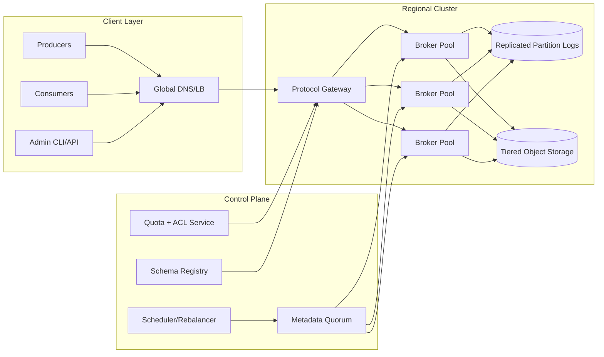
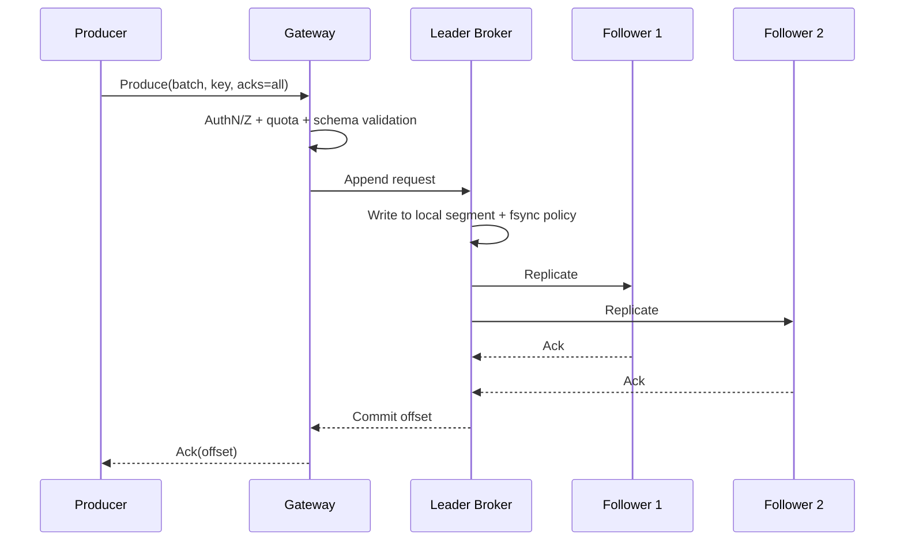
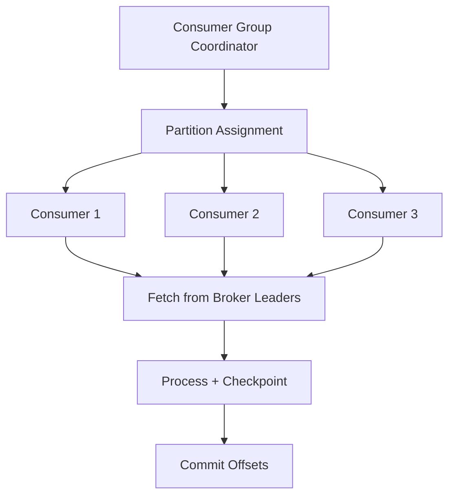

# Question 2: Design a Distributed Stream Processing System like Kafka (IC6/IC7 Depth)

This version targets **Principal Engineer (IC6/IC7)** expectations: explicit durability and ordering contracts, failure-domain-aware replication, tenant isolation, replay/backfill strategy, and an operational model that remains stable at very high throughput.

---

## 1) Clarify Requirements and Product Contract

### Functional Requirements
- Accept high-throughput event writes from many producers across regions.
- Organize data by **topics** and **partitions**, with configurable retention.
- Support consumer groups, offset-based consumption, and replay from arbitrary offsets/timestamps.
- Preserve **ordering within a partition**.
- Support key-based routing (same key -> same partition).
- Support schema evolution and compatibility checks.
- Provide admin APIs for topic lifecycle, ACLs, quotas, and partition rebalancing.

### Non-Functional Requirements (SLO-Oriented)
- **Write availability:** 99.99% monthly for topic classes marked production-critical.
- **Durability:** once ACKed with `acks=all`, permanent-loss probability < 1e-9/event.
- **Publish latency:** p99 < 50 ms intra-region under normal load.
- **End-to-end lag:** p99 producer ACK -> consumer visibility < 2 s for healthy consumers.
- **Scale target:** sustain 300 GB/s aggregate ingress with 2x burst for 30 minutes.
- **Security:** mTLS in transit, encryption at rest, tenant-scoped ACLs and audit trails.

### Scope Boundaries
- In scope: core brokered log (write/read path), replication, offset tracking, retention/tiering.
- Out of scope: full stream SQL runtime and arbitrary stateful operators (we expose hooks/integration points, but not complete Flink/Spark feature parity).

### Explicit Assumptions
- Multi-tenant internal platform used for analytics pipelines, event buses, and CDC.
- Most producers can tolerate retries and idempotent semantics.
- Exactly-once end-to-end is optional and expensive; at-least-once with idempotent producers/consumers is the default contract.

---

## 2) Capacity and Cost Model (Back-of-the-Envelope)

Assumptions:
- 15 million events/sec steady state; 30 million events/sec burst.
- Average compressed event size: 700 bytes.
- Replication factor (RF): 3 across AZs.
- Retention: 7 days hot local disk + 30 days warm object tier.

Calculations:
- Steady ingress bandwidth: `15M * 700B = 10.5 GB/s`.
- Burst ingress bandwidth: `30M * 700B = 21 GB/s`.
- Daily raw ingest volume: `10.5 GB/s * 86,400 = 907,200 GB/day` (~886 TiB/day).
- Daily replicated write volume (RF=3): ~2.66 PiB/day on broker storage paths.
- 7-day hot replicated footprint: ~18.6 PiB before compaction/compression variance.

Principal-level implications:
- Capacity planning must be **network + disk IOPS + controller metadata scale**, not just broker CPU.
- You need explicit **tiered storage/offload** to keep local SSD cost bounded.
- Partition-count governance is as important as byte throughput (metadata fanout and recovery times explode with too many tiny partitions).

---

## 3) Architecture: Data Plane + Control Plane

### Why this decomposition
- **Data plane** (brokers/gateways) handles throughput-sensitive publish/consume traffic.
- **Control plane** (metadata quorum + scheduler) manages partition leadership, ISR membership, placement, and safe movement.
- **Schema/ACL/quota services** enforce policy before data hits critical IO paths.
- **Tiered storage** decouples retention needs from SSD footprint on brokers.

---

## 4) Core Data Model and Partitioning Strategy

### Logical Model
- `topic` -> ordered append-only logs split into `partitions`.
- Each partition is a sequence of immutable **segments**.
- Each record has `(key, value, headers, timestamp, offset)`.

### Partitioning
- Partition key strategy: `hash(tenant_id, topic, business_key)` for tenant fairness + key ordering.
- Maintain a target partition throughput envelope (e.g., 15-30 MB/s write sustained).
- Avoid partition-per-customer unless customer size warrants it; prefer shared partitions + quotas for long tail.

### Replication and ISR
- Leader-follower replication per partition.
- In-sync replica set (ISR) defines replicas eligible for quorum ACK.
- `min.insync.replicas` enforces durability floor before accepting `acks=all` writes.

### Log Compaction + Retention
- Dual mode per topic:
  - **Delete retention** (time/size based) for event streams.
  - **Compaction retention** (latest value per key) for changelog/CDC topics.
- Compaction runs asynchronously with IO budgets to avoid starving foreground reads/writes.

---

## 5) APIs and Contracts

### Producer APIs
- `Produce(topic, partition|key, records, acks, idempotency_key)`
- Semantics:
  - `acks=0/1/all` controls durability-latency tradeoff.
  - Idempotent producer uses `(producer_id, epoch, sequence)` to deduplicate retries.

### Consumer APIs
- `Fetch(topic, partition, offset, max_bytes, max_wait_ms)`
- `CommitOffsets(group_id, topic-partition -> offset)`
- `ListOffsets(topic, timestamp)` for time-based replay.

### Admin APIs
- `CreateTopic`, `AlterTopic`, `DeleteTopic`
- `IncreasePartitions`
- `ReassignPartitions`
- `SetQuota`, `SetACL`

### Contract notes (important)
- Ordering guaranteed only **within a partition**.
- Delivery is **at-least-once by default**.
- Exactly-once is achievable for constrained workflows using idempotent producers + transactional writes + read-process-write discipline.

---

## 6) Write Path Deep Dive (Failure-First)

### Failure handling
- Leader crash before quorum replication -> uncommitted tail may be lost, but ACKed records survive.
- Follower lag -> replica removed from ISR; write availability depends on `min.insync.replicas`.
- Network partition -> controller elects new leader only from ISR to avoid acknowledged-data loss.
- Disk pressure -> throttle producers by topic/tenant and prefer fail-fast over silent corruption risk.

### Principal-level design callout
- Make durability semantics explicit in product docs: teams must know exactly what `acks` levels protect and what they do not.

---

## 7) Read Path, Consumer Groups, and Backpressure

### Group mechanics
- One active consumer per partition per group for ordered processing.
- Rebalance protocol should minimize stop-the-world windows (incremental/cooperative preferred).
- Offset commits are explicit; apps choose at-most-once vs at-least-once via commit timing.

### Backpressure controls
- Broker-side: quotas by tenant/client-id; fetch/produce byte-rate limits.
- Consumer-side: max inflight records, bounded processing queues, pause/resume per partition.
- Global: admission control to protect controller and metadata endpoints during storm events.

---

## 8) Metadata and Control Plane Scalability

### Metadata quorum responsibilities
- Topic/partition metadata, replica assignments, leader epochs, ACL references.
- Membership changes and failover decisions.

### Scale hazards
- Excessive partition count increases:
  - Controller CPU and memory footprint.
  - Metadata propagation latency.
  - Leader election recovery time.

### Mitigations
- Partition budget per tenant and per cluster.
- Auto-placement aware of rack/AZ and disk/network headroom.
- Staged partition movement with throttled replication traffic.
- Separate control-plane SLOs and canarying for metadata changes.

---

## 9) Multi-Region Strategy and DR

### Topology options
- **Active-passive replication** (simpler correctness, better for strict failover runbooks).
- **Active-active regional clusters** with async mirroring (lower local latency, more conflict/dup complexity).

### Recommended baseline
- Keep primary writes in a tenant home region.
- Mirror selected topics cross-region asynchronously.
- Consumers can fail over to mirrored topics with known RPO window.

### Objectives
- RPO for ACKed primary-region data: near-zero within region; cross-region depends on mirror lag.
- RTO: < 30 minutes for regional evacuation with pre-provisioned warm capacity.

---

## 10) Security, Governance, and Multi-Tenancy

- mTLS for all client-broker and broker-broker links.
- ACL model at topic and consumer-group granularity.
- Quotas on produce/fetch bytes/sec and request rate.
- Per-tenant keys and encryption-at-rest with centralized KMS.
- Audit logs for topic ACL changes, deletes, and retention policy updates.
- Schema compatibility policy (`BACKWARD`, `FORWARD`, `FULL`) enforced at publish time.

---

## 11) Operations: What Principal Engineers Instrument

### Golden signals
- Produce/fetch request rate and p50/p95/p99 latency.
- Broker disk utilization, flush latency, page cache hit ratio.
- Under-replicated partitions and ISR churn.
- Consumer lag distribution by topic/group.
- Controller event queue depth and metadata propagation latency.

### Runbooks (examples)
- Under-replicated partition surge response.
- Stuck rebalance diagnosis (slow consumer, bad coordinator, metadata thrash).
- Rolling broker restart with leadership drain.
- Partition hot-spot mitigation via key strategy updates and partition expansion.

### Cost KPIs
- $/TB ingested, $/TB retained-hot, $/TB retained-warm.
- CPU/network cost per million records.
- Tenant-level unit economics and noisy-neighbor incident rate.

---

## 12) Trade-offs and Explicit Alternatives

### Why not a traditional queue only?
- Queue systems optimize point-to-point task dispatch, not replayable high-throughput immutable logs.

### Why not use object storage only?
- Great durability and low cost, but poor low-latency fetch and consumer-group coordination semantics.

### Why not global strict ordering?
- Global ordering severely limits throughput and availability; partition-local ordering is the pragmatic high-scale trade-off.

### Exactly-once everywhere?
- Valuable for financial/critical workflows, but operationally expensive.
- Most pipelines get better reliability-cost balance with at-least-once + idempotency.

---

## 13) Evolution Roadmap (IC6/IC7 Framing)

- **Phase 1:** single-region durable log with RF=3, producer idempotency, and basic consumer groups.
- **Phase 2:** tiered storage, quota enforcement, schema governance, and partition rebalancer automation.
- **Phase 3:** multi-region mirroring, tenant-level SLO classes, and advanced failure automation.
- **Phase 4:** intelligent keying advisor, predictive autoscaling, and policy-driven placement optimization.

Success criteria over roadmap:
- Maintain publish and lag SLOs during broker failures and 2x burst events.
- Keep partition recovery and rebalance times bounded as cluster scales.
- Preserve stable unit economics while retention and tenant count grow.
