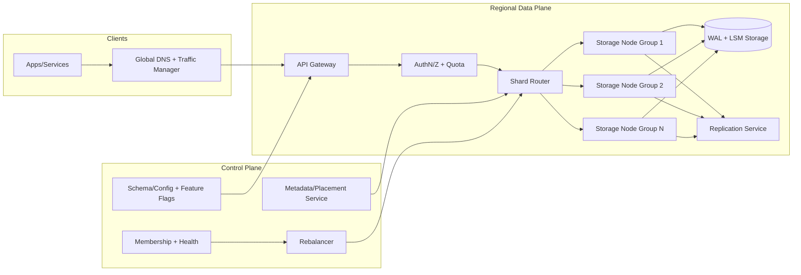
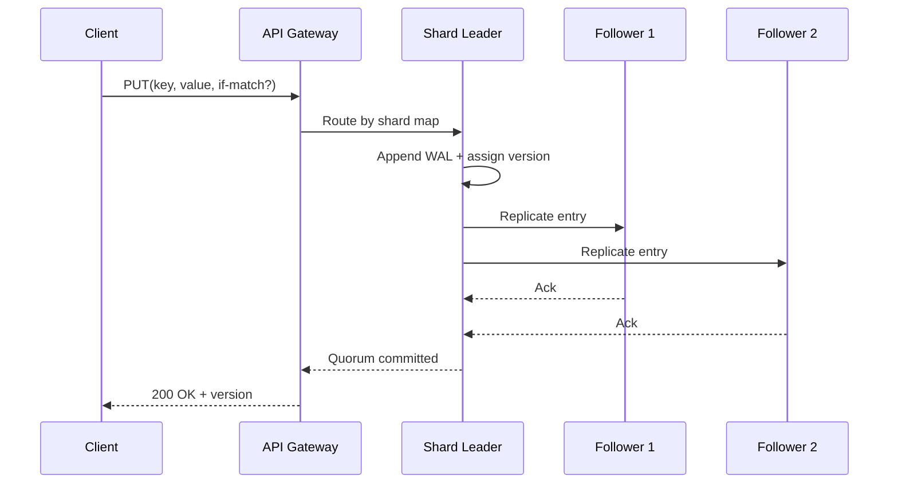
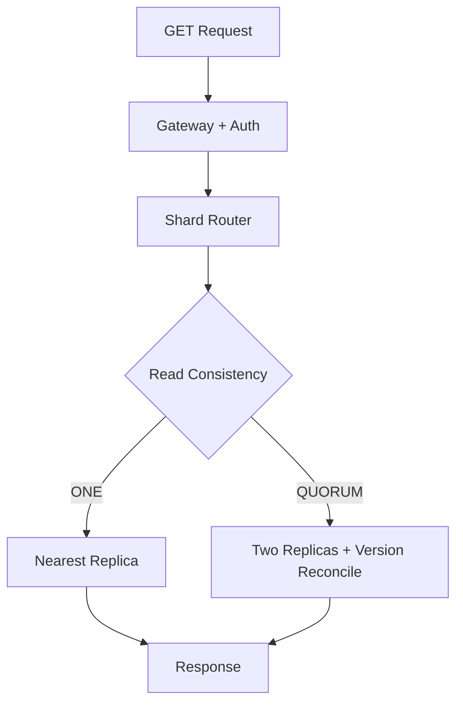

# Question 3: Design a Globally Distributed Key-Value Store (IC6/IC7 Depth)

This version targets **Principal Engineer (IC6/IC7)** expectations: explicit consistency contracts, tail-latency-aware architecture, multi-region failure handling, and clear trade-offs between durability, cost, and developer ergonomics.

---

## 1) Clarify Requirements and Product Contract

### Functional Requirements
- `PUT(key, value, ttl?)` to create/update values.
- `GET(key)` with predictable latency under high read QPS.
- `DELETE(key)` and tombstone semantics for replication correctness.
- Optional conditional writes (`PUT if version == X`) for optimistic concurrency control.
- Optional `BATCH GET/PUT` with bounded payload sizes.
- Namespace isolation by tenant/application.

### Non-Functional Requirements (SLO-Oriented)
- **Read availability:** 99.99% monthly.
- **Write availability:** 99.95% monthly (higher if regional quorum remains healthy).
- **Read latency SLO:** p95 < 10 ms, p99 < 30 ms in-region.
- **Write latency SLO:** p95 < 20 ms for quorum writes in-region.
- **Durability:** once ACKed, permanent-loss probability < 1e-9 per write.
- **Scalability:** sustain 20M reads/sec and 5M writes/sec globally.

### Scope Boundaries
- In scope: primary key-value APIs, replication, sharding, rebalancing, TTL expiration.
- Out of scope: full SQL queries, joins, secondary indexes beyond limited optional local indexing.

### Explicit Assumptions
- Key size <= 1 KB; value size <= 256 KB.
- Workload is read-heavy (80/20 read/write).
- Most access patterns are point lookups; no range scans required in the baseline design.

---

## 2) Capacity and Cost Model (Back-of-the-Envelope)

Assumptions:
- 5M writes/sec, average value payload 512 bytes after compression.
- 20M reads/sec, response payload 512 bytes.
- Replication factor = 3 within a region; async cross-region replica for DR.
- 7-day TTL average (mixed persistent + expiring keys).

Calculations:
- Write ingress bandwidth: `5M * 512B = 2.56 GB/s`.
- Read egress bandwidth: `20M * 512B = 10.24 GB/s`.
- Daily logical writes: `2.56 GB/s * 86,400 ≈ 221 TB/day`.
- Daily replicated writes in-region (RF=3): ~663 TB/day before compaction.

Principal-level implications:
- Network and storage write amplification dominate cost.
- Must prioritize compaction efficiency and tombstone lifecycle management.
- Capacity planning must include hot-key skew and uneven tenant growth, not just global averages.

---

## 3) High-Level Architecture



### Why this decomposition
- Data plane stays simple and fast for GET/PUT critical path.
- Control plane handles placement, rebalancing, and failover policy separately.
- Write-ahead log (WAL) + LSM tree yields high write throughput and efficient compaction.

---

## 4) Data Model, Versioning, and API Contracts

### Record Model
```json
{
  "tenant": "acme-prod",
  "key": "cart:user:12345",
  "value": "...bytes...",
  "version": 918273,
  "ttl_seconds": 86400,
  "write_timestamp_ms": 1776028800123
}
```

### API Surface
- `PUT /v1/kv/{key}` with optional `If-Match-Version` header.
- `GET /v1/kv/{key}` returns value + version + remaining TTL.
- `DELETE /v1/kv/{key}` creates tombstone with new version.
- `POST /v1/kv:batchGet` and `POST /v1/kv:batchPut` with strict per-request size limits.

### Semantics
- Last-write-wins by version/timestamp for baseline conflict resolution.
- Optional compare-and-set (CAS) for correctness-sensitive clients.
- Idempotency token supported for retried writes.

---

## 5) Sharding, Partitioning, and Hot-Key Mitigation

### Partitioning strategy
- `partition_id = consistent_hash(tenant, key)`.
- Virtual nodes (vnodes) enable smoother rebalancing and partial movement.
- Tenant-aware hashing avoids a single large tenant dominating a shard set.

### Hot partition/key controls
- Detect top-N hot keys using streaming counters.
- Apply read-through cache and request coalescing for hot keys.
- For extreme skew: allow logical key fanout (`key#suffix`) with merge logic at client/API tier when semantically safe.

---

## 6) Write Path (Durability and Consistency)



### Consistency levels (client-selectable)
- `ONE`: fastest, may read stale data.
- `QUORUM` (recommended default): balanced latency and consistency.
- `ALL`: strongest within-region, lowest availability during failures.

### Failure handling
- Leader failure: fast re-election from in-sync replicas.
- Partial network partition: continue only if quorum can be formed.
- Disk corruption: checksum verification + replica repair from healthy copies.

---

## 7) Read Path and Tail-Latency Optimization



### Latency controls
- Hedged reads for p99 reduction (after small delay threshold).
- Adaptive replica selection using recent latency EWMA.
- Page cache + block cache tuning by key popularity.
- Negative caching for missing keys with short TTL.

---

## 8) Storage Engine and TTL Lifecycle

- LSM tree with memtable -> SSTable flushes.
- Background compaction merges SSTables, removes obsolete versions/tombstones.
- TTL expiration via lazy deletion on reads + background sweeper.
- Bloom filters on SSTables reduce disk seeks for misses.
- Periodic anti-entropy repair ensures replicas converge.

Trade-off note:
- Aggressive compaction lowers read amplification but increases write amplification and IO cost.

---

## 9) Multi-Region Strategy and DR

### Recommended baseline
- Single-writer home region per tenant, async replication to secondary regions.
- Regional failover via control plane promotion when home region is unavailable.
- Cross-region reads can be allowed with explicit staleness contract.

### Objectives
- **RPO:** seconds to low minutes depending on replication lag.
- **RTO:** < 15 minutes with pre-warmed capacity and automated runbooks.

### Optional advanced mode
- Active-active multi-region writes with conflict resolution (vector clocks/CRDTs) only for use cases that truly need it, due to complexity and higher tail latency.

---

## 10) Security, Multi-Tenancy, and Operations

- mTLS for service-to-service traffic.
- Encryption at rest with per-tenant key hierarchy (KMS-managed).
- Tenant quotas on QPS, storage bytes, and write bandwidth.
- Audit logs for admin operations and key access metadata.
- SLO dashboards: availability, p95/p99 latency, replica lag, compaction debt, rebalance progress.
- Error budget policy ties release velocity to reliability health.

---

## 11) Trade-offs and Interview Discussion Points

- **LSM vs B-Tree:** LSM better for write-heavy workloads; B-Tree can simplify read amplification profile.
- **Quorum defaults:** safer consistency but slightly higher latency than `ONE`.
- **TTL-heavy workloads:** require disciplined tombstone cleanup to avoid storage bloat.
- **Global low latency vs strong consistency:** choose explicitly per API/use case, avoid pretending both are free.

A strong IC6/IC7 answer should end with a clear recommendation matrix (consistency level by workload class), explicit failure drills, and staged rollout/migration plans for shard rebalancing and region failover.
